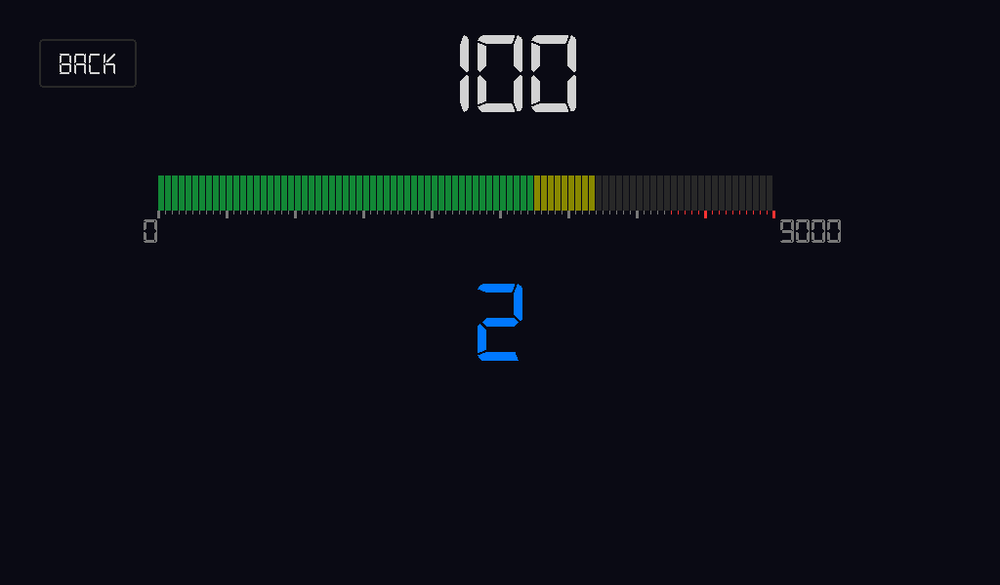

## Gran Turismo 7 Instrument Cluster

[](https://github.com/astral-sh/ruff)

This is an HMI for a Gran Turismo 7 Instrument Cluster. It is written in Python and based on a revised state/event architecture.



## Installation

The codebase uses `uv` for managing the dependencies and the virtual environment. Follow the [installation guide for uv](https://docs.astral.sh/uv/#installation). From the repo root execute

```
uv venv
source .venv/bin/activate
uv sync
```

If your environment is pointing to an old [granturismo](https://github.com/chrshdl/granturismo) lib dependency consider running `uv lock --upgrade` and `uv sync`.


## License
All of my code is MIT licensed. Libraries follow their respective licenses.